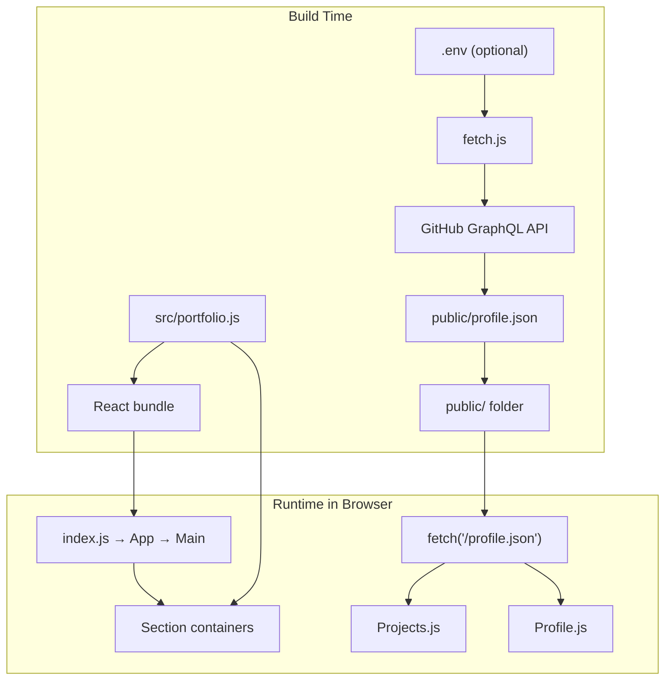
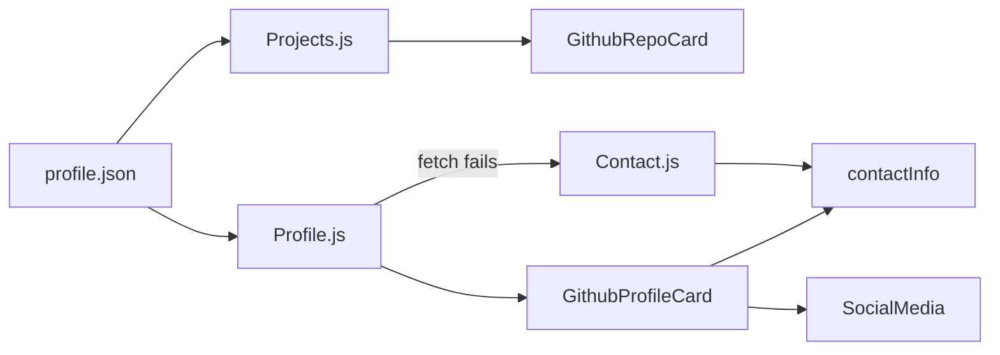
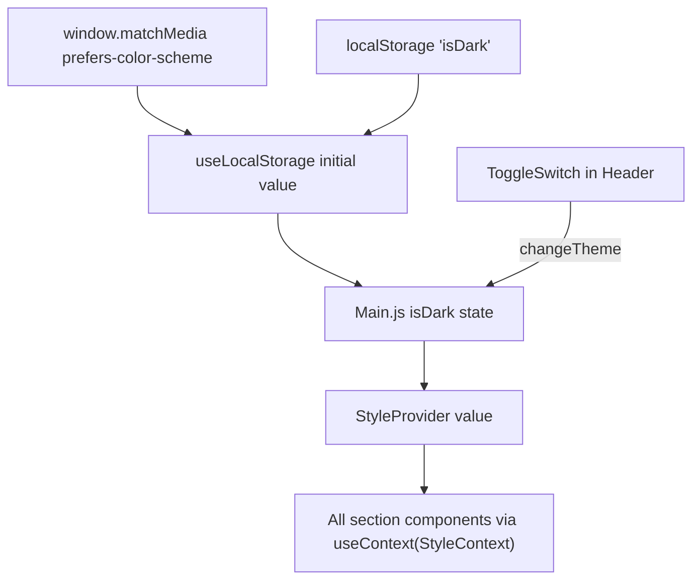

# Portfolio Website — Data Flow & Layout

This document explains how content moves from configuration and external APIs into what you see on [arghyadeep99.github.io](https://arghyadeep99.github.io/). The site is a React single-page application (SPA) built on the [developerFolio](https://github.com/saadpasta/developerFolio) template.

---

## High-Level Architecture

There are **two data sources**:

| Source | Type | Used for |
|--------|------|----------|
| `src/portfolio.js` | Static config (bundled at build time) | Almost all page content |
| `public/profile.json` | Runtime JSON (fetched over HTTP) | GitHub pinned repos & profile card |

Everything else (theme, splash screen timing) is handled in React state and context.



---

## Application Bootstrap

### Entry chain

```
index.js
  └── App.js
        └── Main.js          ← page layout, splash, theme, all sections
```

1. **`index.js`** mounts `<App />` into `#root` from `public/index.html`.
2. **`App.js`** is a thin wrapper that renders `<Main />`.
3. **`Main.js`** is the orchestrator: splash screen, theme provider, and the ordered list of section components.

### Page section order (as rendered in `Main.js`)

When the splash screen finishes, sections appear in this order:

| # | Component | DOM anchor (`id`) | Data source |
|---|-----------|-------------------|-------------|
| 1 | `Header` | — | `portfolio.js` (nav links gated by `display` flags) |
| 2 | `Greeting` | `#greeting` | `greeting`, `illustration`, `socialMediaLinks` |
| 3 | `Skills` | `#skills` | `skillsSection`, `illustration` |
| 4 | `StackProgress` | — | `techStack`, `prof_illustration`, `skillsSection.softwareSkills` |
| 5 | `Education` | `#education` | `educationInfo` |
| 6 | `WorkExperience` | `#experience` | `workExperiences` |
| 7 | `Projects` | `#opensource` | `openSource` + `profile.json` |
| 8 | `VoluntaryWork` | `#projects` | `voluntaryWork` |
| 9 | `Achievement` | `#achievements` | `achievementSection` |
| 10 | `Blogs` | `#blogs` | `blogSection` |
| 11 | `Talks` | `#talks` | `talkSection` |
| 12 | `Twitter` | `#twitter` | `twitterDetails` |
| 13 | `Podcast` | — | `podcastSection` |
| 14 | `Profile` | `#contact` | `openSource` + `profile.json` **or** `contactInfo` |
| 15 | `Footer` | — | hardcoded text |
| 16 | `ScrollToTopButton` | — | no data |

---

## Central Config: `src/portfolio.js`

**This is the single source of truth for static content.** Each exported object maps to one or more UI sections. Components import named exports directly — there is no global store or API layer for this data.

### Exported objects

| Export | Purpose | Key fields |
|--------|---------|------------|
| `splashScreen` | Intro animation | `enabled`, `animation`, `duration` |
| `illustration` | Greeting/Contact Lottie vs SVG | `animated` |
| `prof_illustration` | Skills progress section image | `animated` |
| `greeting` | Hero text | `username`, `title`, `subTitle`, `resumeLink`, `displayGreeting` |
| `socialMediaLinks` | Icon links (Greeting + Contact) | platform URLs, `display` |
| `skillsSection` | “Quirky bits” + software icons | `title`, `skills[]`, `softwareSkills[]`, `display` |
| `educationInfo` | Education cards | `schools[]`, `display` |
| `techStack` | Technical skills bar section | `viewSkillBars`, `experience[]` |
| `workExperiences` | Job history | `experience[]`, `display` |
| `openSource` | GitHub integration toggles | `githubUserName`, `showGithubProfile`, `display` |
| `voluntaryWork` | Side projects / volunteering | `projects[]`, `display` |
| `achievementSection` | Honors & recognitions | `achievementsCards[]`, `display` |
| `certificateSection` | Certifications | `achievementsCards[]`, `display` — **exported but not wired to any component** |
| `blogSection` | Blog list | `blogs[]`, `display` |
| `talkSection` | Talks | `talks[]`, `display` |
| `podcastSection` | Podcast embeds | `podcast[]`, `display` |
| `contactInfo` | Fallback contact section | `title`, `subtitle`, `number`, `email_address` |
| `twitterDetails` | Twitter timeline embed | `userName`, `display` |
| `isHireable` | Overrides GitHub hireable flag | boolean |

Images referenced via `require("./assets/images/...")` are resolved at **build time** by webpack and become URLs in the bundle.

---

## External Data: GitHub (`fetch.js` → `profile.json`)

### Build-time fetch

`package.json` runs `node fetch.js` before both `start` and `build`:

```json
"start": "node fetch.js && react-scripts start",
"build": "node fetch.js && react-scripts build"
```

`fetch.js` reads from `.env`:

- `USE_GITHUB_DATA=true` — enables the fetch
- `GITHUB_USERNAME` — GitHub login
- `REACT_APP_GITHUB_TOKEN` — personal access token for GraphQL

When enabled, it queries the GitHub GraphQL API for:

- User profile: `name`, `bio`, `avatarUrl`, `location`, `isHireable`
- Up to 6 **pinned repositories**: name, description, stars, forks, language, disk usage, URL

The response is written to **`public/profile.json`**, which is served as a static file at `/profile.json`.

If `USE_GITHUB_DATA` is not `"true"`, `fetch.js` does nothing and no fresh file is generated.

### Runtime consumption

Two components fetch `/profile.json` on mount:

#### `Projects.js` (Open Source Projects)

```
useEffect → fetch("/profile.json")
  → response.data.user.pinnedItems.edges
  → setrepo(edges)
  → map each edge → <GithubRepoCard repo={v} />
```

- Renders only if `openSource.display === true` **and** fetch succeeded (repo is not the string `"Error"`).
- On failure: logs error, renders nothing (`FailedLoading` returns `null`).
- “More Projects” button links to `socialMediaLinks.github`.

#### `Profile.js` (Contact section)

```
useEffect (if openSource.showGithubProfile === "true")
  → fetch("/profile.json")
  → response.data.user
  → setrepo(user object)
  → <GithubProfileCard prof={prof} />
```

- Renders GitHub profile card if `openSource.display`, `showGithubProfile === "true"`, and fetch succeeded.
- On failure: falls back to `<Contact />` using `contactInfo` from `portfolio.js`.
- `GithubProfileCard` also reads `contactInfo.subtitle` and `isHireable` from `portfolio.js`.



---

## Section-by-Section Data Flow

### Splash Screen

**Files:** `Main.js`, `SplashScreen.js`, `splashScreen`, `greeting`

1. `Main` starts with `isShowingSplashAnimation = true`.
2. If `splashScreen.enabled`, a timer runs for `splashScreen.duration` ms, then hides splash.
3. `SplashScreen` shows Lottie from `splashScreen.animation` and `greeting.username`.

### Greeting (Hero)

**Files:** `Greeting.js` → `SocialMedia.js`, `Button`

- Guard: `greeting.displayGreeting` — if `false`, returns `null`.
- Renders `greeting.title`, `greeting.subTitle`, resume/contact buttons.
- `SocialMedia` renders platform icons only for URLs that exist in `socialMediaLinks`, gated by `socialMediaLinks.display`.
- Illustration: Lottie (`landingPerson`) if `illustration.animated`, else static SVG.

### Skills (“My Quirky Bits”)

**Files:** `Skills.js`

- Guard: `skillsSection.display`.
- Maps `skillsSection.skills[]` → paragraph elements.
- Note: `SoftwareSkill` is **commented out** in `Skills.js`; software icons are shown in `StackProgress` instead.

### Technical Skills (Stack Progress)

**Files:** `skillProgress.js` → `SoftwareSkill.js`

- Guard: `techStack.viewSkillBars`.
- Progress bars from `techStack.experience[]` are **commented out**.
- Active path: renders `<SoftwareSkill />`, which maps `skillsSection.softwareSkills[]` to icon + label grid.
- Side illustration: Lottie if `prof_illustration.animated`.

### Education

**Files:** `Education.js` → `EducationCard.js`

- Guard: `educationInfo.display`.
- Maps `educationInfo.schools[]` → `<EducationCard school={school} />`.
- Each card receives: `schoolName`, `logo`, `subHeader`, `duration`, `desc`, `descBullets`.

### Work Experience

**Files:** `WorkExperience.js` → `ExperienceCard.js`

- Guard: `workExperiences.display`.
- Maps `workExperiences.experience[]` → `<ExperienceCard cardInfo={...} />`.
- `ExperienceCard` uses ColorThief on the company logo to derive a banner background color.

### Open Source Projects (GitHub)

**Files:** `Projects.js` → `GithubRepoCard.js`, `utils.js`

- See GitHub flow above.
- `formatFileSizeDisplay()` converts repo `diskUsage` (KB) to a human-readable string.

### Voluntary Work

**Files:** `VoluntaryWork.js`

- Guard: `voluntaryWork.display`.
- Maps `voluntaryWork.projects[]` inline (no separate card component).
- Each project: `image`, `projectName`, `projectDesc`, optional `footerLink[]` (click opens URL in new tab).

### Achievements

**Files:** `Achievement.js` → `AchievementCard.js`

- Guard: `achievementSection.display`.
- Maps `achievementSection.achievementsCards[]` → cards with `title`, `subtitle` → `description`, `image`, `footerLink`.

### Blogs

**Files:** `Blogs.js` → `BlogCard.js`

- Guard: `blogSection.display`.
- Maps `blogSection.blogs[]` → cards with `url`, `title`, `description`, optional `image`.

### Talks, Podcast, Twitter

| Section | Guard | Data → UI |
|---------|-------|-----------|
| `Talks.js` | `talkSection.display` | `talks[]` → `TalkCard` |
| `Podcast.js` | `podcastSection.display` | `podcast[]` → `<iframe src={url}>` |
| `twitter.js` | `twitterDetails.display` && `userName` | Embeds timeline via `react-twitter-embed`; theme follows `isDark` |

Currently in config: Talks, Podcast, and Twitter are **`display: false`**.

### Contact / Profile

**Files:** `Profile.js` → `GithubProfileCard.js` **or** `Contact.js`

- Final section before footer; anchor is always `#contact`.
- GitHub path merges API data (`bio`, `avatarUrl`, `location`) with static `contactInfo` and `isHireable`.
- Fallback `Contact` uses `contactInfo` + `SocialMedia` + email Lottie/SVG.

### Header Navigation

**Files:** `Header.js`

Nav links are **conditionally rendered** from the same `display` flags as their sections:

- Skills → `skillsSection.display`
- Education → `educationInfo.display`
- Experience → `workExperiences.display`
- Projects → `openSource.display`
- Achievements → `achievementSection.display`
- Blogs → `blogSection.display`
- Talks → `talkSection.display`
- Contact → always shown

Logo text comes from `greeting.username`.

**Note:** Voluntary Work has no nav link in `Header.js` even when visible.

---

## Cross-Cutting Concerns

### Theme (dark / light mode)



- `Main.js` wraps the app in `<StyleProvider value={{ isDark, changeTheme }}>`.
- `useLocalStorage("isDark", darkPref.matches)` persists preference.
- Root `<div>` gets class `dark-mode` when `isDark` is true.
- Child components read `isDark` for conditional CSS classes and a few asset swaps (e.g. Django icon in dark mode in `SoftwareSkill.js`).

### Animations

- **react-reveal** (`Fade`, `Slide`, etc.) wraps most sections for scroll animations.
- **lottie-react** via `DisplayLottie` for splash, greeting, skills, contact illustrations.
- Animation vs static image is controlled by `illustration.animated` and `prof_illustration.animated`.

### Lazy loading

- `GithubRepoCard` and `GithubProfileCard` are `React.lazy()` loaded with `<Suspense>` fallbacks to `Loading.js`.

---

## Display Toggle Pattern

Most sections follow the same pattern:

```javascript
import { someSection } from "../../portfolio";

export default function SomeSection() {
  if (!someSection.display) {
    return null;
  }
  return (/* map someSection.items → cards */);
}
```

To show or hide a section, edit the `display` (or `viewSkillBars` / `displayGreeting`) flag in `portfolio.js`. The header nav respects the same flags for most sections.

### Current visibility (from config)

| Section | Visible? |
|---------|----------|
| Splash | yes (`enabled: true`) |
| Greeting | yes |
| Skills | yes |
| Technical Skills (icons) | yes (`viewSkillBars: true`) |
| Education | yes |
| Work Experience | yes |
| GitHub Projects | yes |
| Voluntary Work | yes |
| Achievements | yes |
| Blogs | yes |
| Talks | no |
| Twitter | no |
| Podcast | no |
| Certificates | **not mounted** (`certificateSection` unused) |

---

## Build & Deploy Pipeline

```
npm run build
  ├── node fetch.js          (optional GitHub → profile.json)
  └── react-scripts build    (portfolio.js + assets → build/)
npm run deploy
  └── gh-pages -b main -d build
```

- Homepage URL is set in `package.json`: `"homepage": "https://arghyadeep99.github.io/"`.
- Static output goes to `build/` and is pushed to the `main` branch via `gh-pages`.

---

## Quick Reference: Edit Content

| I want to change… | Edit this |
|-------------------|-----------|
| Name, tagline, resume link | `greeting` in `portfolio.js` |
| Social links | `socialMediaLinks` |
| Personality / fun facts | `skillsSection.skills` |
| Tech stack icons | `skillsSection.softwareSkills` |
| Schools & degrees | `educationInfo.schools` |
| Jobs | `workExperiences.experience` |
| Volunteering | `voluntaryWork.projects` |
| Awards & hackathons | `achievementSection.achievementsCards` |
| Blog posts | `blogSection.blogs` |
| GitHub pinned repos | Pin repos on GitHub + ensure `fetch.js` / `.env` |
| Contact fallback text | `contactInfo` |
| Hide a section | Set `display: false` on that section object |
| Section order | Reorder imports/components in `Main.js` |
| Nav links | `Header.js` (and matching `display` flags) |

---

## File Map

```
src/
├── portfolio.js              ← all static content config
├── index.js                  ← React entry
├── App.js                    ← renders Main
├── contexts/StyleContext.js  ← theme context
├── hooks/useLocalStorage.js  ← theme persistence
├── containers/
│   ├── Main.js               ← layout orchestrator
│   ├── greeting/Greeting.js
│   ├── skills/Skills.js
│   ├── skillProgress/skillProgress.js
│   ├── education/Education.js
│   ├── workExperience/WorkExperience.js
│   ├── projects/Projects.js  ← fetches profile.json
│   ├── VoluntaryWork/VoluntaryWork.js
│   ├── achievement/Achievement.js
│   ├── blogs/Blogs.js
│   ├── talks/Talks.js
│   ├── twitter-embed/twitter.js
│   ├── podcast/Podcast.js
│   ├── profile/Profile.js    ← fetches profile.json OR Contact
│   ├── contact/Contact.js
│   └── splashScreen/SplashScreen.js
└── components/               ← presentational cards, header, footer, etc.

fetch.js                      ← build-time GitHub GraphQL → public/profile.json
public/profile.json           ← generated; not in repo unless committed
```

---

*Generated from codebase analysis. Template origin: [developerFolio](https://github.com/saadpasta/developerFolio).*
